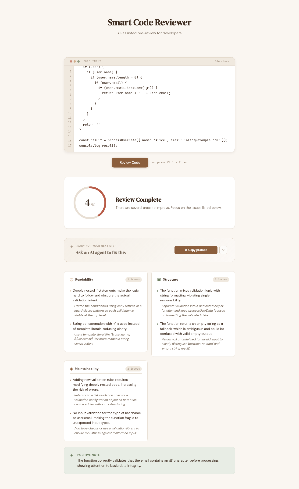

# Smart Code Reviewer

AI-assisted pre-review tool for developers. It performs an early, practical
code review (Readability, Structure, Maintainability) before a human review,
using an OpenAI-compatible LLM API.

This repo contains a SvelteKit frontend (`apps/web`) and a Hono backend
(`apps/api`). During local development, Vite proxies browser requests from
`/api` to the backend at `http://localhost:3000`, so the frontend never has to
know about LLM credentials.

## Tech Stack

| Layer    | Tech                    |
| -------- | ----------------------- |
| Runtime  | Bun                     |
| API      | Hono                    |
| LLM      | OpenAI-compatible API   |
| Validation | zod                  |

## Project Structure

```text
.
├── PRD.md
├── package.json          # Bun workspace root
└── apps/
    ├── api/              # Hono + Bun backend
        ├── src/
        │   ├── index.ts        # public exports
        │   ├── server.ts       # HTTP entrypoint
        │   ├── app.ts          # Hono app, CORS, error handling
        │   ├── routes/
        │   │   └── review.ts   # POST /api/review
        │   └── lib/
        │       ├── config.ts   # env config
        │       ├── errors.ts   # typed API errors
        │       ├── llm.ts      # OpenAI-compatible client (timeout + retries)
        │       ├── prompt.ts   # structured review prompt
        │       ├── review.ts   # orchestration + JSON validation
        │       └── types.ts    # domain types
    │   └── test/              # unit + integration tests
    └── web/              # SvelteKit frontend
```

## Setup

```bash
bun install
cp apps/api/.env.example apps/api/.env
```

Then fill in `apps/api/.env`:

```env
LLM_API_KEY=your-key
LLM_BASE_URL=https://api.openai.com/v1
LLM_MODEL=gpt-4o-mini
```

The API key is only ever used on the backend. It is never exposed to the
frontend and `.env` is git-ignored.

## Run

```bash
bun run dev            # starts the API on :3000 and the web app on :5173
# or run either service individually
bun run dev:api
bun run dev:web
```

Server listens on `PORT` (default `3000`).

## Docker

The Docker setup runs both services: the Bun API and the SvelteKit frontend
(static build) served by Nginx, which also proxies `/api` to the backend so
everything lives behind a single origin.

```bash
cp apps/api/.env.example apps/api/.env
# Fill in LLM_API_KEY, LLM_BASE_URL, and LLM_MODEL.
docker compose up --build
```

Services and ports:

| Service | Container port | Host port (env override) |
| ------- | -------------- | ------------------------ |
| `api`   | `3000` (internal only) | `API_PORT`, default `3000` |
| `web`   | `80` (nginx) | `WEB_PORT`, default `3080` |

The web app is available at `http://localhost:3080`, and the API health check
at `http://localhost:3080/health`. The API is only reachable through the Nginx
proxy; it is not exposed directly to the host.

## Testing

Live test against the deployed instance: https://reviewer.fadhil-andriawan.dev/

Test input (nested validation that an AI reviewer should flag):

```js
function processUserData(user) {
  if (user) {
    if (user.name) {
      if (user.name.length > 0) {
        if (user.email) {
          if (user.email.includes('@')) {
            return user.name + ' ' + user.email;
          }
        }
      }
    }
  }
  return '';
}

const result = processUserData({ name: 'Alice', email: 'alice@example.com' });
console.log(result);
```

Result: overall score **4/10**, with 2 issues each across Readability,
Structure, and Maintainability, plus a positive note.



## API

### `GET /health`

Health check.

### `POST /api/review`

Request:

```json
{
  "code": "function a(d) { return d; }"
}
```

Response:

```json
{
  "score": 7,
  "readability": [
    { "issue": "Variable naming is too generic", "suggestion": "Use a descriptive name." }
  ],
  "structure": [],
  "maintainability": [],
  "positiveNote": "The function has a clear responsibility."
}
```

Errors are returned as:

```json
{ "error": { "message": "...", "type": "ValidationError" } }
```

| Status | Condition                                        |
| ------ | ------------------------------------------------ |
| 400    | Empty, invalid, or too-long code (max 20,000 chars) |
| 401    | LLM API key missing or rejected                  |
| 429    | LLM rate limit reached                           |
| 502    | LLM returned an error or an invalid response     |
| 504    | LLM request timed out                            |

## Configuration

| Variable          | Default | Description                          |
| ----------------- | ------- | ------------------------------------ |
| `LLM_API_KEY`     | (required) | Provider API key                  |
| `LLM_BASE_URL`    | (required) | OpenAI-compatible base URL        |
| `LLM_MODEL`       | (required) | Model name                        |
| `LLM_TIMEOUT_MS`  | `30000` | Per-request timeout                |
| `LLM_MAX_RETRIES` | `2`     | Retries on 5xx / rate limits       |
| `MAX_CODE_LENGTH` | `20000` | Max snippet length in characters   |
| `PORT`            | `3000`  | HTTP port                          |
| `CORS_ALLOWED_ORIGINS` | `http://localhost:5173` | Comma-separated permitted browser origins |
| `MAX_REQUEST_BODY_BYTES` | `25000` | Maximum JSON request size |
| `RATE_LIMIT_MAX_REQUESTS` | `10` | Requests per client per window |
| `RATE_LIMIT_WINDOW_MS` | `60000` | Rate-limit window duration |
| `MAX_CONCURRENT_REVIEWS` | `4` | Concurrent LLM review cap per process |

For public deployments, set `CORS_ALLOWED_ORIGINS` to the exact frontend
origin and enforce matching rate limits at a WAF or reverse proxy. The
in-process limiter protects a single API instance only. The repository includes
`deploy/nginx.conf` as a deployable Nginx baseline with matching body-size,
rate-limit, method, timeout, and request-buffering controls.

## Tests

```bash
bun test --cwd apps/api
bun run check
```
